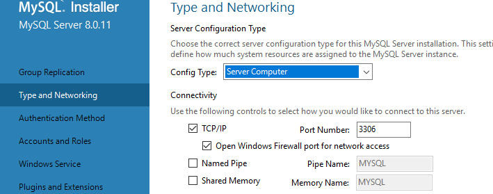
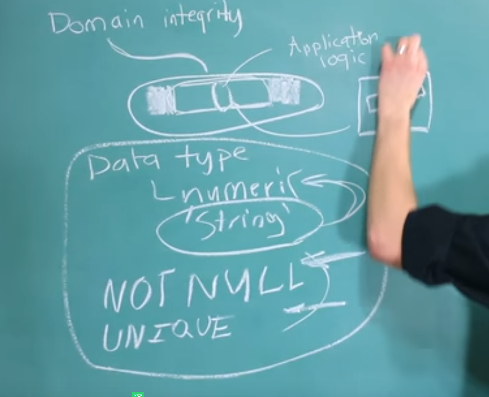
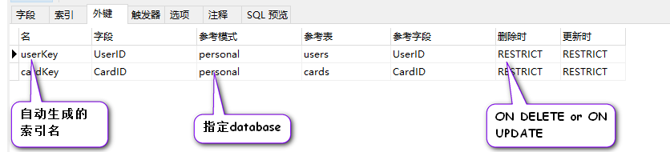

# node_mysql

## Bookshelf prototype vs. class properties

https://github.com/bendrucker/ama/issues/11

## Mongodb learn 


### mysql 的安装 

* 一般采取的做法是 与安装mongodb时一样， 我们以net 命令 将 mysql 服务安装到后台之中

* 按 win + s 键 输入 services 打开服务面板，查看已经安装的服务，

> a list of services that are running, we we open our computer

 

  

  

> 参考链接 ： https://www.cnblogs.com/qlqwjy/p/8010598.html

net start 服务名

net stop 服务名

sc delete mysql // 这句命令 一是不能利用powershell 运行，没反应； 而是 需要 cmd 的管理员权限；

1. 安装mysql

> 安装版的即使下载的时 5.6.4 版本的，实际安装的还是 8.0.1 版本的，所以直接去下 zip 版本的就可以了； 按照下面的安装步骤进行安装

> https://jingyan.baidu.com/article/f3ad7d0ffc061a09c3345bf0.html

2. 初始化密码

https://blog.csdn.net/qingyuanluofeng/article/details/48679903

```bash
# 在mysql的bin目录下输入:
mysqladmin -u root -p password 123456

# 出现enter password后，直接回车，即可
# 之所以按回车 是因为我们的初始密码就是 回车

```

3. 登陆

https://blog.csdn.net/hjulkk/article/details/52562894

```bash
mysql -u root -p 

#  自己设置的密码为 123456

```

4. 卸载

* 停止服务 net stop mysql
* 删除服务 sc delete mysql
* 删除 解压的文件夹


### navicat 的安装 以及 数据库的导入 导出

1. 安装包 ：  自己放到了百度云上了

2. 数据的导出

* 这个数据库上面，鼠标右键，选择转储SQL文件---> 结构和数据
* 选择 导出的位置

3. 数据的导入

* 右键 服务组（小海豚logo） ---> 新建数据库 ---> 命名的方式应与要导入的名字一致
* 双击新建的数据库（新建的数据库是灰色的，双击之后变为绿色）
* 右键新建的数据库 --> 运行 sql 文件 --> 选择自己备份的sql文件 --> 运行 


### principle

1. table: is realation 

* columns are the headers of the table , the table will also have a name , so we can say this is the membership table, then the columns are going to list the data we want to store about memerships(全体会员) . 

* rows are data that we put in to match these columns , but we give actural data not just categories of data 

* we can think of the rows as instances of whatever the table is describing,  so each row is an example of membership(会员) 

* record : is just another name for a row ; 即 record 与 row 时同一个东西的两种说法；

* field : usually describes one value inside of a column or you aiso call it a cell .  some people will think the whole column is a field 

* entry: 条目

2. database design : is known as data integrity(数据完整性)

> database design makes us ask questions like what tables do i need , what columns do i put in that table , do i allow them to be null or do i force then all to have a value 


3. entity && attribute

* an entity is just a thing we store data about 
* attributes are the things we store about that entity  

4. data integrity

* data integrity means that the attributes we are tstoring about the entity  

5. primary key 

* primary key is unique and not null   
    + natrual key is something that exists in the real world ,e.g, email
    + surrogate key is just a value that's generated by the database genarally an ID 

6. foreign key is a column that references column in another table . Often This will point back to a primary key but It could not have to reference a primary key , it colud reference unicle column. essentially(本质上) it's just a way to reference another entity and that entity has to be labeled unique or else it's not going to know which entity you want to reference .  

7. constraint are something that are important to protect our data interity because they force relationships to hold true 

8. data type: there is one situation where you need to be extra careful with the data type that you give a column . when you have a foreign key word and it reference a primary key , they both have to be the same type that's super important if you're having problems creating foreign keys that might be part of the problem (the primary key might be a different data type than what you are trying to make the foreign key ) 

9. index : you can tell the database to index important columns and in fact it's going to index certain columns automatically , primary keys and unique columns are automatically indexed, but foreign keys on hte other hand are not automatically indexed but oftentimes you will want to manually index them because we use them so much . what an index does is increase the speed that we can work with these columns . so we are going to select a column that are part of an index we are going to have a much faster query 

10. relationship 

> relationShips are created when we have a column that references column in a database this is what's known as a foreign key .  
> A column is a forrign key if it references another column and that column it references has to be either a primary key or have the unique attribute 
> when we do above we create a relationship.

* there are three types of relationships:
    + one-to-one
    + one-to-many
    + many-to-many

    

*  one-to-one relationship： is an attribute that describes an entity you can just store it in the same table , you don't have to create a whole another table for it  you can though . Though if you want that separation for some reason ,e.g., you want some data of the user stored in a different table . The only thing you're going to remember is to mark the foreigin key as unique that's because we don't want to have mutiple entries relating back to one entity that would break the rules of one-to-one and that is acturally how you set up a one-to-many relationship


* one-to-many : we can store as many rows as we want referencing back to a single entity and that foreign key is not going to be labeled unique . The parent table being referenced doesn't need to know about this other table , you don't have to put any foreign keys in that table to that table that other table donesn't exist . It's just alone by itself , but that table that references  it knows of the parent table 

> in summary one-to-one is just one table. One-to-many is two tables. Many-tomany is three tables


#### data integrity

1. entity interity

> entity interity is very simple . All it says is that every table needs a primary key when you label something a primary key . It's automatically going to be unique and not null . Addition to this a primary key should never change  . `Unique` `not null` `never change`

2. There is acturally two classifications(类别) of primary keys 

* surrogate keys(代理鍵) 

> surrogate key are simple . They just are computer generated numbers that have no real world meaning 

* natural keys 


2. referential integrity

> When it comes to be referential integrity, it has to fo with foreign keys referencing oter columns . Only have a froeign key we could say " it's a reference to another column " and we need to protect our reference integrity; we need tell the database explictly using the foreign key constraint that what column from what table we are referencing 

> in additional to just tell what is referencing what , we can do stuff such as ON DELETE and ON UPDATE. both is meaning waht happend if we dalete the parent or change the parent to a different ID 

* ON DELETE

* ON UPDATE

3. domain integrity

> domain integrity is essentially when our data fits what is appropriate or what is expected for a certain colmn . This is require us to define what is allowed and what is not allowed . we want to ensure that the data is as close as posiible to what is expected 

> The domain establish what's what is alowed and what is not allowed. so we want to make sure all of our data fit insides of both . 

> 即 在 数据不能偏离我们“想要的模样”太远， 又不能进入“不想要的模样”， 及其只能处在某一个区域中或范围中，这个区域就是一个 domain. 保证数据处在domain 中 就是 domain integrity



* Data type
* NOT NULL
* UNIQUE

> mysql 不能去做类似于 必须保证数据 处在 5 到 50之间的类似的校验， 一般只能去校验上述三种； 我们一般采取的方式是在程序层面 对数据做校验，以保证我们所存储的data 是我们想要的data;

#### AUTO_INCREMENT


* compound or composite key

> a composite key is a key that consists of multiple columns and that reason you do this is if you need to figure out a way to make the row unique and one ID or column is not enough to do it . You will often see this inside of an intermediary(中间人) table (many-to-many situation)


#### Column attribute related to foreign keys

> foreign keys reference primary key . When we make a call on foreign key we are saying every single value in this column has to be a value that exists and whatever column or referencing .

> a foreign key has to reference a column that is unique 

> rather than having tables reference this way it's to rotate the whole thing and create parents children . So the foreign key down here is the child pk 

> 注意转变一个认知 ， 被引用的row 是 parent row ， 而 主动引用的row 是 child row ;  when we reference a column using a foreign key, we create what is known as a parent-child relationship.  The column the foreign key is referencing is known as the parent and the foreign key is known as the child. 
 



#### ON DELETE and ON UPDATE

1. ON DELETE

> ON DELETE is essentially a way we can config the way our foreign keys work and it mainly points to what happends when we delete the parent row fererenced by the FK, what happends to the child. There are acturally four options with MYSQL:  default option is RESTRICT

* RESTRICT: is literally going to prevent us from deleting the parent. So if we go and delete the parent row you are going to get an error and MYSQL is not going to let us do that ;

* CASCADE: will acturally send the same command down to the child and delete the child , So if we delete the parent row , the child row will be deleted as well 

* NO ACTION: is just another name for RESTRICT , but is not always the same thing in different datbase management , but in mysql thry're the same thing;

* SET NULL: if we delete the parent , the clumn in the child referencing the parent row will be setted to be null. It might be useful is we want to be able to delete the parent but we don't want to delete the child 

2. ON UPDATE

> the reason on `ON UPDATE` is used less  is that primary key are not support to change . So it is onle useful when we're referencing unique data that's not primary kay .

> FK can reference a unique clumn , bu the unique column doesn't have to be primary key 

主要是关注 被引用的column 的值发生改变的会对FK 产生什么样的影响； 如 引用的userID 是8;
我们在父表上将 原想 userID 为 8 的行，中的userID 字段改为 7； 而由于 userID 一般为primary key , 不允许更改，所以ON UPDATE 平时运用的不多；

#### Normalization

> normalization is a process we go through when we're designing a database to help make sure our database has the right structure .

> Normalization has three steps: 1nf, 2nf, and 3nf.  These stand for first normal form, second normal form, and third normal form.  Each step has rules on what is allowed or not allowed in our database design.  Each normal form gets progressively more strict.  

> Each normal form has to have the previous one done , that is 4nf require the 1nf and 2nf to be done.


* how do these normal forms work? how do they acturally improve our database structure ?

the primary way they help us is by getting rid of redundancy(冗余). Redundancy is when we have someting in a database more than once .


1. 1NF (first normal form)

> first normal form is first layer of nomalization , it gets rid of the most obvious and the  most simple mistake in our database design . first normal form really focuses on things being atomic or sigularity 

```
First normal form (1NF) is the first layer of database normalization.  The focus of 1NF is atomicity (singularity).  Every column needs to hold only one attribute and only one value for that attribute.  This means that columns should not be plural.  Additionally, one entity can take up only one row and one row can describe at max one entity.  

In our example, we had a column called social_networks.  This implies that multiple values can be inserted per row.  To fix this, we can make it singular.  The downside to this is that you are limited to just one value for that column.  If you wanted to have two or more social networks you have to add a table with a foreign key that references the user_id.  This allows multiple social networks because multiple rows in the network table can reference a single user.  

Finally, we need to make sure that each attribute   describes the entity.  Every column needs to describe the key.

```

> 注解1 `sigularity`： 一个column 中只能去存放有一个值， 若存有多个值，就考虑将 多个值存到另外一张表中，然后在表中相应的值的行中 去新建一个 FK 去引用 原表中的 column ; 多个值 可以去引用同一个 column ; 形成 one-to-many 的结构；one 是 parent row , many 是 child row ; 注意方向； 这也是 one-to-many 一般是两张表的原因 

> 注解2 one entity can take up only one row and one row can describe at max one entity.  

> 总结： 一个列中 只能有一个值  （需要存放多个值时，需要转化为one-to-many的形式，即两张表）： 一个行中 只能去描述一个entity;   everything inside a first normal form you could cummarize it as every column describr the key , and every column describes it singularly, so each column is individual and there is no repeating rows 


2. 2NF  emands that we remove all partial dependencies. 

* dependency :  is when something depends on something else and in databse that would be like an attribute describing an entity. So if we have an entity we have attributes that describe this entity. We can say the attributes depends on the entity . The deoendency means when the thing we're talking about changes, the data describing it will also change.

* the 2NF discuses a type of dependency known as partial dependencies . 

* `Partial dependencies` come in when we have compound or primary keys. A composite key is a key that consists of multiple columns . let's consume we have another column that depends on the primary key which consist of  multiple columns , it has to depend every column of the composite key . if for any reason it only depends on one of the column  we have what's known as a partial dependency    

* we will most often see second normal form come up when we have a many-to-many relationship . In our bidding website example, we have a users table, a listings table, and a user_listings table.  The primary key in the user_listings table is the combination of a user and a listing id.  That's because it is an associate between a user and a listing.  Because we have a composite primary key in the user_listings table, we have to make sure that any additional columns depend on both of the columns in the composite key. The example I use in this video is the listing_date that is improperly placed inside of the user_listing table.  `We get rid of this column and put it in the listings table.` ( 之所以这样做是因为，listing_data 只依赖与composite key 中的listing id, 而不依赖于 user id , 这就造成 patial dependency 的现象， 而 2NF 推荐的避免方式是，既然 listing_data 只依赖 list id ,  就将listing_data 从 user_listings table 单独的拿出去，放到listings table 中)

* what kind of data would be approciate in the user_listing table , we need to find some kind of data that dapends on user Id and the listing ID that means the data in here only describes the association between the user and the listing . So an example of a column might be the percentage of income when the item is sold


3. 3NF 

> 3NF is going to be the most strict that's because second normal form and dirst normal form have to be done and it's going to have some of its own rules .


* transitive dependency ： The odd thing though about this column is it's a type of dependency known as a transitive dependency . What that means it it depends on the primary key through another column . So it acrually depends on this category which depends on the listing_id （即虽然上图中 category-description 依赖于 listing-id , 但其同时也依赖于 category , 或者欢聚话说，其之所以会依赖listing-id 是 通过 category 产生的， A transitive dependency exists when a column depends on the primary key through another column. ）

* 3NF says we're not allowed to have transitive dependencies. We need to make this column depend only on the primary key, so to do this we need to move some stuff to a new table.  


```bash
# for example 的简写
I love animals, e.g., dogs, pigs and cats. (O)
I love animals, e.x., dogs, pigs and cats. (X)

# an so on 等等的缩写
I know a few of great teachers (e.g., Mary, Sandy, Susan). (O)
I know a few of great teachers (e.g., Mary, Sandy, Susan, etc.) (X)

# in other words 换句话说的缩写
It happened in August, i.e., two months ago. (O)

```

写程序分为三个阶段 ： 跑通 --> 健壮 --> 优雅； 
学习分为三个阶段： 视频 --> 文档 --> 源码  