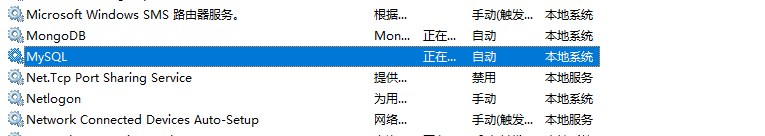

# node_mysql

## Bookshelf prototype vs. class properties

https://github.com/bendrucker/ama/issues/11

## Mongodb learn 


### mysql 的安装 

* 一般采取的做法是 与安装mongodb时一样， 我们以net 命令 将 mysql 服务安装到后台之中

* 按 win + s 键 输入 services 打开服务面板，查看已经安装的服务，

> a list of services that are running, we we open our computer

 

  

  

> 参考链接 ： https://www.cnblogs.com/qlqwjy/p/8010598.html

net start 服务名

net stop 服务名

sc delete mysql // 这句命令 一是不能利用powershell 运行，没反应； 而是 需要 cmd 的管理员权限；

1. 安装mysql

> 安装版的即使下载的时 5.6.4 版本的，实际安装的还是 8.0.1 版本的，所以直接去下 zip 版本的就可以了； 按照下面的安装步骤进行安装

> https://jingyan.baidu.com/article/f3ad7d0ffc061a09c3345bf0.html

2. 初始化密码

https://blog.csdn.net/qingyuanluofeng/article/details/48679903

```bash
# 在mysql的bin目录下输入:
mysqladmin -u root -p password 123456

# 出现enter password后，直接回车，即可
# 之所以按回车 是因为我们的初始密码就是 回车

```

3. 登陆

https://blog.csdn.net/hjulkk/article/details/52562894

```bash
mysql -u root -p 

#  自己设置的密码为 123456

```

4. 卸载

* 停止服务 net stop mysql
* 删除服务 sc delete mysql
* 删除 解压的文件夹


### navicat 的安装 以及 数据库的导入 导出

1. 安装包 ：  自己放到了百度云上了

2. 数据的导出

* 这个数据库上面，鼠标右键，选择转储SQL文件---> 结构和数据
* 选择 导出的位置

3. 数据的导入

* 右键 服务组（小海豚logo） ---> 新建数据库 ---> 命名的方式应与要导入的名字一致
* 右键新建的数据库 --> 运行 sql 文件 --> 选择自己备份的sql文件 --> 运行 


