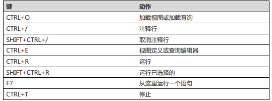

# Mysql tutorial from command


## navicat use

### Using Navicat Code Snippets

> https://www.navicat.com/en/company/aboutus/blog/693-using-navicat-code-snippets.html


## important terms 

1. Database : is a collection of tables where the data is stored in a systematic format 

2. Tables : is just a matrix(母体) or rows and columns 

3. columns : is a long stack of cells that has data of the same type 

4. Row : is just a record 

5. primary key is usually a unique and that could not coour twice in the table 

6. foreign key : is just something that links two tables together 

7. compound key : is acturally a key that consists of multiple columns . Sometimes one column is not enough to give us acquired uniqueness in our table 

8. index: 

9. redundancy :


## connecting to Mysql Server

```bash
# Ubuntu 环境中

# 查看mysql 版本信息
mysqladmin --version 

# 初始化root密码
mysqladmin -u root password "123456"

# connect to the server
mysql
# login by root user 
mysql -u root -p 

# show all database
show databases;
SHOW DATABASES;

# unlink the server
quit;

```

## Adding && Deleting Users 新建于删除用户（用户操作）

> https://blog.csdn.net/u013216667/article/details/70158452

> 输入命令的时候一定要加上 ; 负责 mysql 会认为 命令没有输入完毕；
> 所有的这些命令 都可以在 navicat 上面去运行，主要是会有智能提示（按tab 键 快速选择提示）；
> 真正写代码的时候，所有的命令都应该先在 navicat 中测试一遍；

```bash
# login by root user 
mysql -u root -p

# show all database
SHOW DATABASES;

# spec mysql database
USE mysql;

# show all the tables from mysql database
SHOW TABLES;

# 主要是通过控制 mysql.user 来控制用户'
SHOW COLUMNS FROM user;

# insert a new user
INSERT INTO user
(host, user, password,select_priv, insert_priv, update_priv)
VALUES ('localhost', 'chris', PASSWORD('chris2014'), 'Y', 'Y', 'Y');
# localhost means you will only to be able to connect from the local computer ; we can allow remote connections using the percentage sign(%);  
# 在Ubuntu服务器下，MySQL默认是只允许本地登录，因此需要修改配置文件将地址绑定给注释掉：#bind-address = 127.0.0.1     #注释掉这一行就可以远程登录了 

# 赋予某个用户权力
# 给某个用户的权限 第一个* 指的是数据库 第二个 *  指的是 表； *.* 表示赋予用户操作服务器上所有数据库所有表的权限
GRANT ALL PROVILEGES ON *.* TO 'chris'@'localhost';
# e.g. 给来自10.163.225.87的用户joe分配可对数据库vtdc的employee表进行select,insert,update,delete,create,drop等操作的权限，并设定口令为123。
# https://blog.csdn.net/wengyupeng/article/details/3290415
grant select,insert,update,delete,create,drop on vtdc.employee to joe@10.163.225.87 identified by ‘123′;

# mysql 新设置用户或更改密码后需用flush privileges刷新MySQL的系统权限相关表，否则会出现拒绝访问，还有一种方法，就是重新启动mysql服务器，来使新设置生效。­
FLUSH PRIVILEGES;

# 删除用户
DROP USER 'chris'@'localhost';

```

1. ALL PRIVILEGES 

* CREATE allows them to create new tabels or databases
* DROP allows them to them to delete tables or databases
* DELETE allows them to delete rows from tables
* INSERT allows them to insert rows into tables
* SELECT allows them to use the Select command to read through databases
* UPDATE allows them to update table rows 
* GRANT OPTION allows them to grant or remove other user's privileges  

2. navicat 快捷键



## Creating & Seleting & Deleting Databases

```bash
# Create 
CREATE DATABASE my_database;

# SELECTE
USE mydata_base;

# DROP
DROP DATABASE my_database


```

## Mysql Data Type


## Creating & Deleting Tables

```bash
# e.g.
CREATE DATABASE teams_db;
USE teams_db;

# Create 
CREATE TABLE table_name (column_name column_type);
# e.g.
CREATE TABLE teams_tbl
(
	team_id INT NOT NULL AUTO_INCREMENT,
	team_name VARCHAR(100) NOT NULL,
	team_captain VARCHAR(40) NOT NULL,
	establishment_date DATE,
	PRIMARY KEY (team_id)
);     

# remove
DROP TABLE table_name;

# Showing Struture of Tables
SHOW COLUMNS FROM table_name;
DESCRIBE table_name;

# inserting Data into Tables
INSERT INTO table_name ( field1, field2, ....fieldN )
VALUES ( value1, value2, ...valueN );

# view all data in the table
SELECT * from table_name;

```

## The SELECT Statement/Query/Command

```bash
# SELECT what ro select FROM table(s) [WHERE condition that the data must satisfy]
# Comparison operators are: < <= = != >= >
# Logical operator are: AND OR NOT 
# Comparison operator for special value NULL : IS

#  查看表中的所有行
SELECT * from table_name;

# 查看表的所有record 中的某几个field
SELECT team_id, team_captain FROM teams_tbl;

#  查看满足condition的record 所有 columns
SELECT * FROM president WHERE team_comptain="Joe williams";

# What if I want to make things a little bit more interesting I can say ,e.g., give me a list if all the teams which were established for example after 2008  
# 查看指定时间之后的所有record 
SELECT * FROM teams_tbl WHERE establishment_date > '2018-5-15';

# if we want to allow some values to have null value then when we acturally filter out for them and use
# 处理值为 null 的情况 ,  需要使用 IS 关键字，而不是 =
SELECT * FROM teams_tbl WHERE  establishment_date = NULL; (X)
SELECT * FROM teams_tbl WHERE establishment_date IS NULL; (v)

# we can use more than one condition at the same time. This is very useful sometimes when you have some data repeated in the same table 
# syntax: 
SELECT field1, field2, ...fieldN FROM table_name1, table_name2... [WHERE condition1 [AND [OR] ] condition2 ...]
# example 1: 多条件查询
SELECT * FROM teams_tbl WHERE establishment_date IS NULL AND team_name = 'RNG' ;

```

## More on SELECT - DATE, ORDER, GROUP BY

```bash
# 查看最近三年的数据
# teams which were established in the last 3 years
# YEAR() function which extracts the year part from the date  
SELECT * FROM teams_tbl WHERE ( YEAR(NOW()) - YEAR(establishment_date) ) < 3;

# we can order the table ascendently and choose the first record only; so we can limit the number of rows that are coming back as the result of our select statement. 
# ASC 升序 日期最前的在最上  
# DESC 降序
# LIMIT 1: only one record  限制 打印条数
#-------------------------------------------------------------
# 按日期先后 打印 所有record
SELECT * FROM teams_tbl ORDER BY establishment_date ASC；
# 按日期先后 只打印最上面的一条 record
SELECT * FROM teams_tbl ORDER BY establishment_date ASC LIMIT 1; 

#  we said we have a miastake and we have teo teams with the exact same team_captain . Well we can acturally use the key words GROUP BY which will group them and only give us one of them;
#---------------------------------------------------
# GROUP BY team_captain : 相同的team_captain 的条目 会合为一个record; 具体会展示 哪一条， 会根据排序来
# ORDER BY team_name DESC ： 按 名称 首字母来降序， z 最上 a 最下
SELECT * FROM teams_tbl GROUP BY team_captain ORDER BY team_name DESC LIMIT 3;

```

## More on SELECT - querying multiple tables

* create another table results_tbl

```bash
CREATE TABLE results_tbl
(
	result_id INT NOT NULL AUTO_INCREMENT,
	team_id INT NOT NULL,
	result_type VARCHAR(4) NOT NULL,
	game_date DATE,
	PRIMARY KEY (result_id)
); 

```
* insert records 

```bash
# results_tbl 主要是用来记录队伍比赛记录的表格 draw：平局 loss: 失败 win: 胜利
INSERT INTO results_tbl 
(
	team_id,
	result_type,
	game_date
)
VALUES
(
	2,
	'draw',
	2015-03-07
);
# team_id 为 2的 队伍，2015-03-07 的比赛记录为`平局` 

```

* query results_tbl and teams_tbl at the same time

```bash
# 打印 队伍比赛的信息 
SELECT team_name, result_type, game_date FROM teams_tbl, results_tbl 
WHERE teams_tbl.team_id = results_tbl.team_id; 

```

##  The DELETE Statement/Query/Command

```bash
# syntax 
DELETE FROM table_name [WHERE Clause];

# delete everything in the table without [WHERE Clause]
DELETE FROM table_name;

# e.g.
DELETE FROM results_tbl WHERE result_id=5;

```

## The UPDATE Statement/Query/Command

> Update an already existing table or modify some data inside it ;

```bash
# syntax 
UPDATE table_name SET filed1=new-value1, field2=new-value2 [WHERE Clause]

# e.g.
UPDATE teams_tbl SET captain_name = "Alan Matthews" WHERE team_name="Uxbridge UTD";

UPDATE results_tbl SET result_type="Loss" WHERE result_id=3;


```

## The LIKE Clause
> what if we only know a part of a value , and with the partial to SELECT records;

```bash
# syntax
SELECT field1, field2, ....fieldN FROM table_name1, table_name2.... 
WHERE field1 LIKE condition1 [ AND [OR] ] condition2

# e.g.
# The percentage sign is a meta character that means give me anything that has the word 'lvj' ; equal to '*lvj' in the regular expression;
SELECT * from teams_tbl WHERE caption_name LIKE '%lvy';

```

## Using REGEXP - Regular Expressions

> to use the regular expressions to do partial string matching 

```bash
# Query to find all the teams starting with 'L'
SELECT team_name FROM teams_tbl WHERE team_name REGEXP '^L';

# Query to find all the teams ending with 'UTD'
SELECT team_name FROM teams_tbl WHERE team_name REGEXP 'UTD$';

# Query to find all the names, which contain 'on'
SELECT team_name FROM teams_tbl WHERE team_name REGEXP 'on';

# Query to find all the names starting with a vowel or ending with 'UTD'
SELECT team_name FROM teams_tbl WHERE team_name REGEXP '^[e]|UTD$'


```

## The ALTER Command

> ALTER is a command that we sometimes use whenever we want to modify am existing table. So sometings one wants to a name of a table or maybe change a field or maybe add or delete an exsiting column or field in a table . The command you will use is the ALTER command. 

```bash
# CREATE a new table
CREATE TABLE crowds_tbl (
	game_id INT NOT NULL,
	game_date DATE NOT NULL,
	crowd_count INT NOT NULL,
	total_sales DOUBLE(12,2) NOT NULL DEFAULT 0.00
);

# DROP a column within the crowds_tbl
ALTER TABLE crowds_tbl DROP game_date;

# ADD a column within the crowds_tbl
ALTER TABLE crowds_tbl ADD date_of_date DATE NOT NULL;

#------------lication -------------
# Place a column in a specific place
# ADD a column and place it in the FIRST;
ALTER TABLE crowds_tbl ADD game_date DATE NOT NULL FIRST;

# ADD a column and place it AFTER a specific column;
ALTER TABLE crowds_tbl DROP game_date;
ALTEr TABLE crowds_tbl ADD game_date DATE NOT NULL AFTER game_id;

#------------type-----------------
# MODIFY a column's type
ALTER TABLE crowds_tbl ADD myclomn DATE NOT NULL;
ALTER TABLE crowds_tbl MODIFY mycolumn CHAR(10);

# rename the table
ALTER TABLE crowds_tbl RENAME TO fans_tbl;

```
 
## PRIMARY KEY vs INDEX

1. The different between the primary key and index:

* THe Primary key is a logical object. It simply define a set of properties on one column or a set of coulmns to require that columns which make up the primary key are unique and that non of the are null.

* Because they are unique and not null, these values(or value if you primary key is a single column) can be used to identify a single row in the table every time.

*  In most if not all database platforms the primary key will have an index created on it.

* An index on the other hand doesn't define uniqueness.

* An index is used to more quickly find rows in the table based on the values which are part of the index.

* When you create an index within the database, you are creating a physical object which is being saved to disk.

> Instead of our database engine loading the whole table in memory then looking up the data that's required in  the conditions of that statement , what the database engine will do is it will only load the index object taht we create . Remember we said this physical object . that will peed things up

> The drawback is that the update statement will become slower . This is because whenever we update the table then we need to update the index  


##  Creating Table INDEX - More on ALTER

```bash
# syntax
# with unique index two rows will not have the same index value; if we don't use the UNIQUE key words that means we are haveing a simple index and with a simple index duplicate values are allowed 
CREATE [UNIQUE] INDEX  index_name ON table_name (column1, column2, ...);
 
CREATE UNIQUE INDEX EST_DATE_INDEX ON teams_tbl (establishment_date);

# syntax2
# add primary key with ALTER command
ALTER TABLE tbl_name ADD PRIMARY KEY (column_list);

# add index with ALTER command
ALTER TABLE tbl_name ADD UNIQUE index_name (column_list);
ALTER TABLE tbl_name ADD INDEX index_name (column_list);

```

## Using Temporary Tables

```bash
# utilize the TEMPORARY key to establish a temporary table;
CREATE TEMPORARY TABLE crowds_tbl (
	game_id INT NOT NULL,
	game_date DATE NOT NULL,
	crowd_count INT NOT NULL,
	total_sales DOUBLE(12,2) NOT NULL DEFAULT 1.00
);

INSERT INTO crowds_tbl(
	game_id, game_date, crowd_count, total_sales
) VALUES(
	21, '2017-07-11', 3352, 144525.20
);

```

## Cloning Tables

1. clone the table structure

```bash
# generate create command
# \g 等价于 ';' 即使用 \g statement 末尾不需要添加 ; mysql 就知道 语句已经结束；
# \G 意思是使 输出结果 90度 反转； 语句末尾同样 不需要去使用 ';' 否则会报错；
SHOW CREATE TABLE 'teams_tbl' \G
# -- CREATE TABLE `teams_tbl` (
# --   `team_id` int(11) NOT NULL AUTO_INCREMENT,
# --   `team_name` varchar(100) NOT NULL,
# --   `team_captain` varchar(40) NOT NULL,
# --   `establishment_date` date DEFAULT NULL,
# --   PRIMARY KEY (`team_id`)
# -- ) ENGINE=InnoDB AUTO_INCREMENT=5 DEFAULT CHARSET=latin1

# 将上述的语句 在 控制台上输入一遍， 并将table_name 改一下， 就生成了一张新表 并且信标的额结构与被复制表的结构一致，但没有数据；

```

2. inject the data to the new table

```bash
INSERT INTO new_table_name (
	# all the columns in the table copied;
	team_id, team_name, team_captain, establishment_date
) SELECT * FROM old_table_name; 

```

## Export using SELECT


